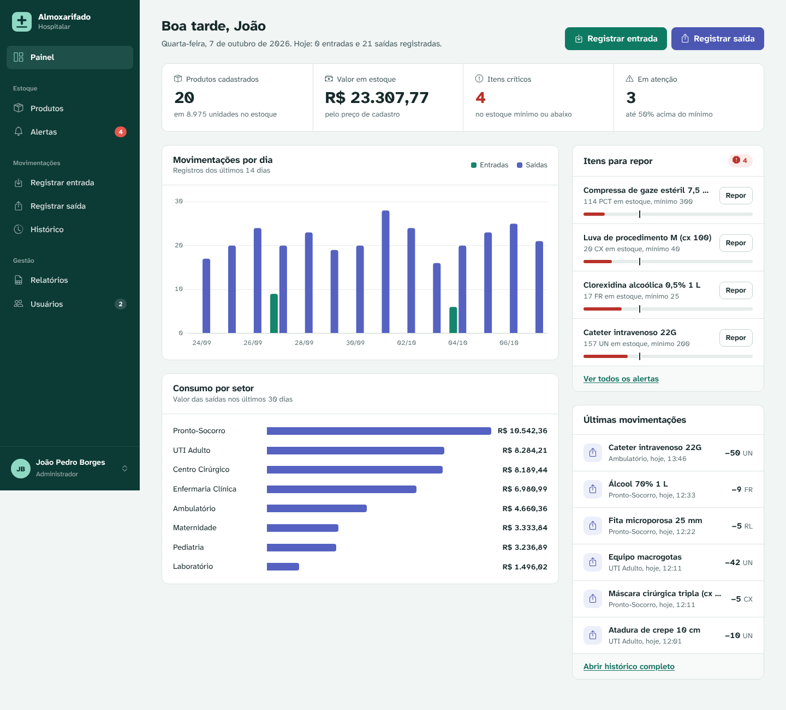
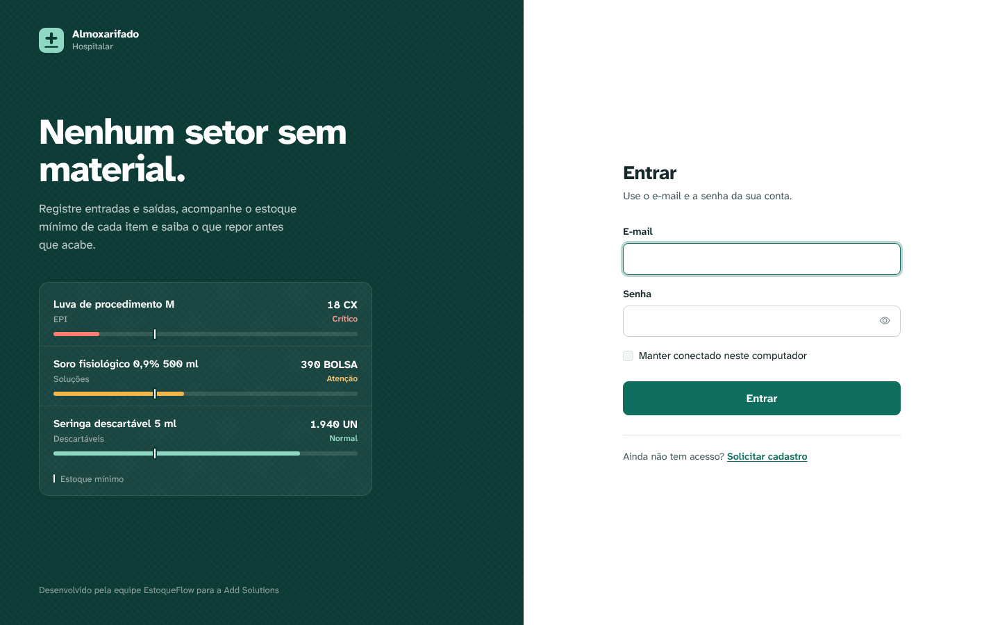
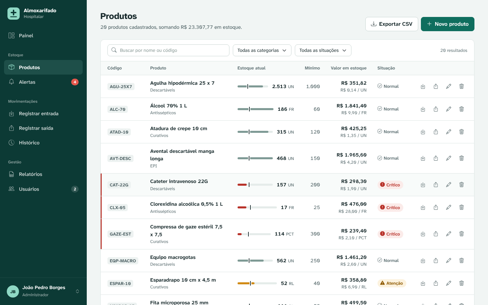
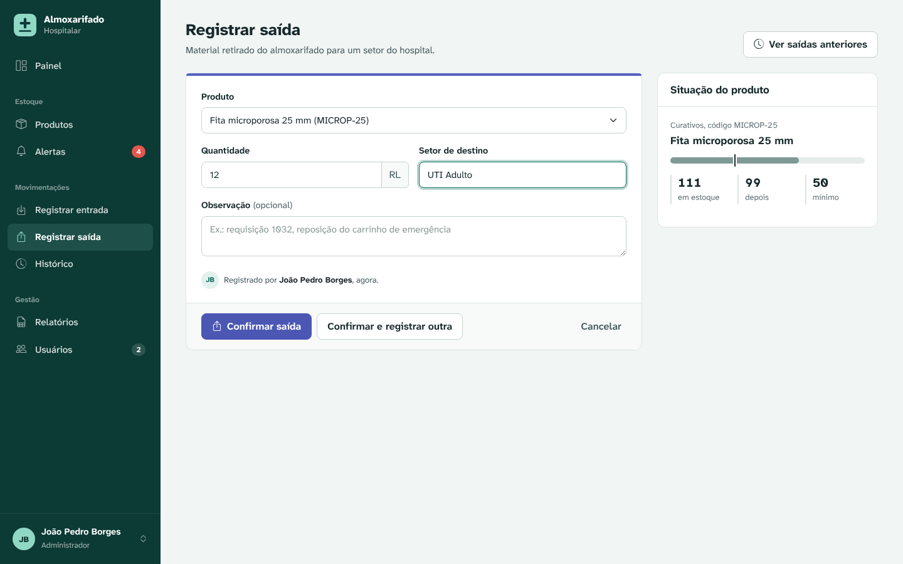
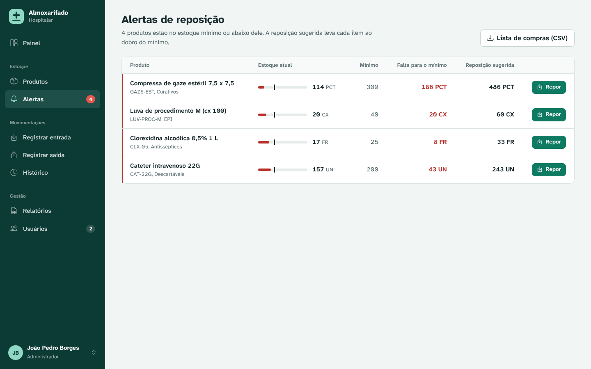

# Almoxarifado Hospitalar

Sistema web de controle de estoque para almoxarifados hospitalares. Ele registra entradas e saídas de materiais, mostra para qual setor cada item foi e avisa quando um produto chega ao estoque mínimo.

Projeto da disciplina de Gerenciamento de Projetos (IFMS), desenvolvido pela equipe **EstoqueFlow** (João Pedro Borges, Matheus Costa e Guilherme Alves) para a **Add Solutions**.



## Funcionalidades

| Módulo | O que faz |
|---|---|
| **Acesso** | Login com e-mail e senha, cadastro com aprovação do administrador, bloqueio após 5 senhas erradas e "manter conectado" |
| **Painel** | Indicadores do estoque, gráfico de movimentações dos últimos 14 dias, consumo por setor (30 dias), itens para repor e últimas movimentações |
| **Produtos** | Cadastro, edição e exclusão, com código único, filtros por nome, código, categoria e situação, e régua visual do estoque mínimo |
| **Entrada** | Registro de material recebido, com prévia do estoque depois da entrada |
| **Saída** | Registro com **setor de destino**, validação de estoque (nunca fica negativo) e aviso quando o item vai ficar crítico |
| **Histórico** | Todas as movimentações, com quem registrou, filtros por tipo, produto, setor e período, e paginação |
| **Alertas** | Produtos no estoque mínimo ou abaixo, com o que falta e a reposição sugerida |
| **Relatórios** | Exportação em CSV (abre direto no Excel): estoque completo, lista de reposição, movimentações e resumo por categoria |
| **Usuários** | Aprovação de cadastros, perfis de acesso, desativação de contas e redefinição de senha |

### Perfis de acesso

| Ação | Almoxarife | Administrador |
|---|:---:|:---:|
| Ver painel, produtos, histórico e alertas | ✔ | ✔ |
| Cadastrar e editar produtos | ✔ | ✔ |
| Registrar entradas e saídas | ✔ | ✔ |
| Exportar relatórios | ✔ | ✔ |
| Excluir produtos | | ✔ |
| Aprovar cadastros e gerenciar usuários | | ✔ |

## Como rodar (Docker)

Precisa apenas do [Docker Desktop](https://www.docker.com/products/docker-desktop/) instalado.

```bash
docker compose up -d --build
```

Depois abra **http://localhost:5000**.

1. No primeiro acesso, o sistema pede para criar a conta do **administrador**.
2. Com o estoque vazio, o painel oferece o botão **Carregar dados de demonstração**: ele cria 20 produtos hospitalares com 4 semanas de movimentações, útil para apresentações e testes.
3. Outras pessoas entram em **Solicitar cadastro** na tela de login, e o administrador aprova em **Usuários**.

| Serviço | Endereço |
|---|---|
| Sistema | http://localhost:5000 |
| Adminer (ver o banco) | http://localhost:8080 (servidor `db`, usuário `postgres`, senha `postgres123`, base `almoxarifado`) |

Para parar: `docker compose down`. Os dados ficam guardados no volume `postgres_data` e voltam no próximo `up`.

### Atualizando a partir da versão 1.0

Os dados existentes são preservados. Na primeira inicialização, o sistema cria as tabelas novas e ajusta as antigas sozinho: cada produto ganha um código (`PRD-00001`, `PRD-00002`…) e as movimentações ganham o campo de setor.

Use sempre `--build` no comando acima. Sem ele, o Docker pode reaproveitar a imagem antiga.

### Antes de colocar em produção

Copie o `.env.example` para `.env` e troque a `SECRET_KEY` (chave que protege os cookies de login) e a senha do banco:

```bash
python -c "import secrets; print(secrets.token_hex(32))"
```

## Como rodar sem Docker (desenvolvimento)

Precisa de Python 3.11 ou mais novo e de um PostgreSQL rodando.

```bash
python -m venv venv
venv\Scripts\activate          # Windows  (no Linux/Mac: source venv/bin/activate)
pip install -r requirements.txt

set DB_HOST=localhost          # Linux/Mac: export DB_HOST=localhost
set DB_PASSWORD=postgres123
set FLASK_DEBUG=1
python app.py
```

## Estrutura do projeto

```
app.py                  cria a aplicação: login obrigatório, proteção CSRF, filtros e páginas de erro
routes/                 telas do sistema, uma por módulo
  auth.py               login, cadastro, primeiro acesso, perfil e saída
  painel.py             painel inicial e dados de demonstração
  produtos.py           produtos e alertas
  movimentacoes.py      entrada, saída e histórico
  relatorios.py         exportação CSV
  usuarios.py           gestão de usuários (só administrador)
services/service.py     regras de negócio (validações, duplicidade, senhas, permissões)
models/                 classes Produto, Movimentacao e Usuario, com validação nos setters
database/db.py          acesso ao PostgreSQL e migração automática do banco
database/demo.py        dados de demonstração
reports/relatorios.py   geração dos arquivos CSV
utils/                  formatação (moeda, datas) e segurança (CSRF, permissões)
templates/              páginas HTML (Jinja2)
static/                 CSS, JavaScript, fonte e bibliotecas (funciona sem internet)
ui/ e main.py           versão desktop antiga (Tkinter), mantida como histórico
```

## Segurança

- Senhas guardadas com hash (scrypt, via Werkzeug), nunca em texto puro.
- Senha com no mínimo 8 caracteres, letras e números.
- Conta bloqueada por 10 minutos depois de 5 tentativas erradas.
- Token CSRF em todos os formulários.
- Cadastro público fica pendente até um administrador aprovar.
- O sistema impede que fique sem nenhum administrador ativo.
- Saídas usam trava no banco (`SELECT … FOR UPDATE`): duas saídas ao mesmo tempo não deixam o estoque negativo.
- Container roda com usuário sem privilégios e servidor de produção (Gunicorn).

## Publicar no Docker Hub

```bash
docker compose build app
docker push joaopedroborges/almoxarifado:2.0
```

## Novidades da versão 2.0

**Acesso e usuários (novo)**
- Tela de login, cadastro com aprovação, primeiro acesso guiado, perfil do usuário e troca de senha.
- Perfis Administrador e Almoxarife.
- Cada movimentação registra automaticamente quem a fez.

**Escopo documentado que faltava na versão web**
- Setor de destino nas saídas.
- Filtros de produtos por nome, código, categoria e situação.
- Exportação CSV pelo navegador (antes só existia na versão Tkinter).
- Reposição direto do alerta, com a quantidade sugerida já preenchida.

**Correções**
- Bug do produto duplicado: agora existe um código único por produto, e nome ou código repetido mostra uma mensagem clara em vez de um erro do banco.
- Saídas simultâneas não deixam mais o estoque negativo.
- Datas no fuso de Mato Grosso do Sul (antes ficavam em UTC dentro do container).
- O formulário não perde o que foi digitado quando dá erro.

**Interface**
- Novo visual com painel de indicadores e gráficos, régua de estoque mínimo, notificações e confirmação antes de excluir.
- Funciona no celular.
- Fonte Atkinson Hyperlegible, criada para máxima legibilidade.
- Bibliotecas e fontes incluídas no projeto: o sistema funciona em rede interna, sem internet.

## Telas

| | |
|---|---|
|  |  |
|  |  |
